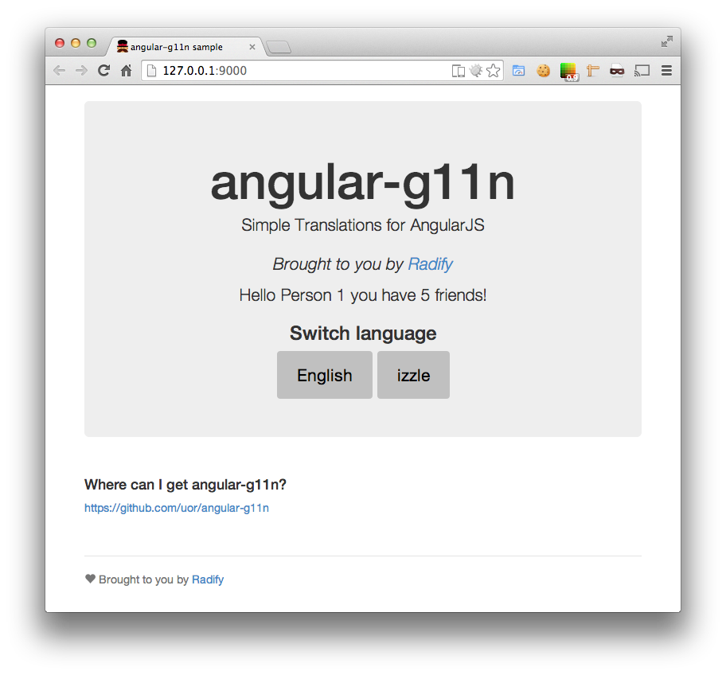
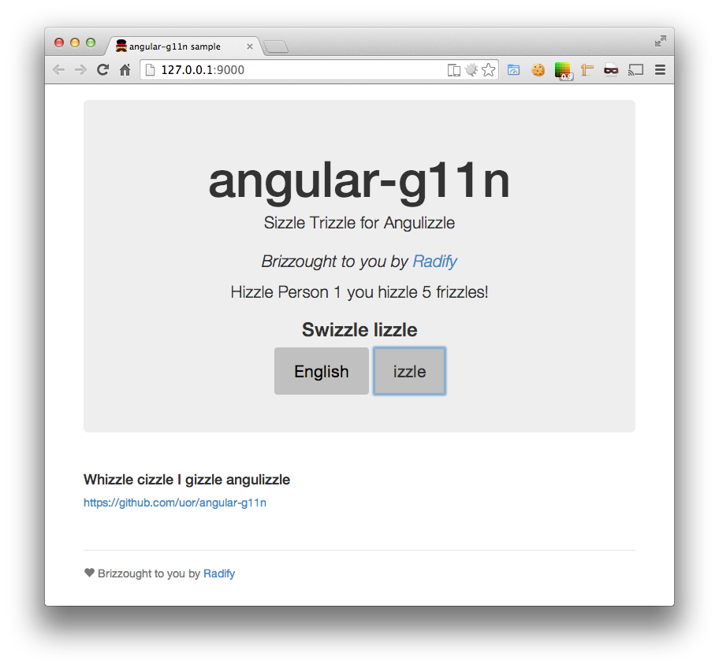

# Manual

## Sample application

The sample application requires Bower to install the dependencies. Have a look in docs/sample in this project:

```bash
cd docs/sample
npm install --dev
bower install
grunt serve
```

That will start a server where you can see angular-g11n in action :-)

The sample application looks like this:



You can press the "izzle" button to translate into "izzle" speak:



The files we suggest looking at are:

* docs/sample/app/bower.json - example of how to configure Bower to install angular-g11n
* docs/sample/app/views/main.html - examples of how to translate things in the templates
* docs/sample/app/catalogs/*.json - g11n catalog files
* docs/sample/app/scripts/app.js - loads the g11n files and configures the Locale service
* docs/sample/app/scripts/controllers/main.js - you can see how to load/switch languages dynamically in here

P.s.: a good place to start with a new Angular app is using Yeoman, that's how we started here:

```bash
yo angular sample
```

## Using full strings as keys

It can be easier to use full strings as keys, e.g.:

```javascript
// ...
    Locale.set('en', {
        "Where can I get angular-g11n?": "Where can I get angular-g11n?"
    });
// ...
```

This makes it easier to grep the codebase. Also, if a key is not found, angular-g11n will fall back to the key itself, meaning you can simply omit translations for your default language, e.g.:

```javascript
// ...
    Locale.set('en', {
    });
    Locale.set('izzle', {
        "Where can I get angular-g11n?": "Whizzle cizzle I gizzle angulizzle"
    });
// ...
```

It's up to you whether you use full strings or define some sort of key format.

## Managing your translations

If you have more than a few strings to translate, then you'll want to separate them out into separate files rather than banging them all into your app.js.

```javascript
LocaleLoader.catalogs([
    {lang: 'en', url: '/catalogs/lang-en.json'},
    {lang: 'izzle', url: '/catalogs/lang-izzle.json'}
]);
```

## Interpolation

You can use interpolation with g11n to say things like "hello person, you have 3 friends". You can even change the copy based on the number that is being passed in as the 'count' parameter! This is easier to demonstrate than to explain. Let's add a key `hello-world` to the language files:

app/catalogs/lang-en.json:

```json
{
    "lead-copy": "Simple Translations for AngularJS",
    "brought-to-you-by": "Brought to you by",
    "Where can I get angular-g11n?": "Where can I get angular-g11n?",
    "hello-world": {
        "0": "Hello {{ name }} you have no friends!",
        "1": "Hello {{ name }} you have one friend!",
        "n": "Hello {{ name }} you have {{ count }} friends!"
    }
}
```

app/catalogs/lang-izzle.json:

```json
{
    "lead-copy": "Sizzle Trizzle for Angulizzle",
    "brought-to-you-by": "Brizzought to you by",
    "Where can I get angular-g11n?": "Whizzle cizzle I gizzle angulizzle",
    "Switch language": "Swizzle lizzle",
    "hello-world": {
        "0": "Hizzle {{ name }} you hizzle no frizzle!",
        "1": "Hizzle {{ name }} you hizzle one frizzle!",
        "n": "Hizzle {{ name }} you hizzle {{ count }} frizzles!"
    }
}
```

Now in app/catalogs/views/main.html:

```html
  <p>{{ 'hello-world' | t: { name: "Person 1", count: 5 } }}</p>
```

## Changing language on the fly

It's not much good having multiple languages if they have to be switched in the source code! So, let's write a simple directive that allows us to switch languages. Let's build a simple language switcher.

So, let's open up app/scripts/controller.js and add an action. This is how the sample app does it:

```javascript
'use strict';

angular.module('sampleApp')
  .controller('MainCtrl', function ($scope, LocaleLoader, Locale) {
    angular.extend($scope, {
        /**
         * set the locale to the locale defined by 'key'
         * @param key e.g. 'en_US'
         */
        setLocale: function(key) {
            LocaleLoader(key).then(function(lang) {
                Locale.uses(lang);
            });
        }
    })
  });
```

Here's some HTML to put into views/main.html (as per the sample app):

```html
<div class="jumbotron">
  <h1>angular-g11n</h1>
  <p class="lead">
    {{ 'lead-copy' | t }}
  </p>
  <p><em>{{ 'brought-to-you-by' | t }} <a href="http://radify.io">Radify</a></em></p>

  <h2>Switch language</h2>
  <button class="btn btn-large" ng-click="setLocale('en')">English</button>
  <button class="btn btn-large" ng-click="setLocale('izzle')">izzle</button>
</div>
<!-- ... -->
```

You could persist this to your user's profile to ensure they get the same language every time they visit. You can also read the user's locale setting from the user's browser:

```javascript
window.navigator.language
```

For more information, please see [API.md](API.md).

# Documentation

[README.md](../README.md) - overview and quickstart guide.

[API.md](API.md) - details of the methods available in the angular-g11n API.

[managing-g11n-as-csv.md](managing-g11n-as-csv.md) - you can manage g11n using CSV files if JSON doesn't suit you.

[LICENSE](../LICENSE) - terms and conditions.

[CONTRIBUTING.md](../CONTRIBUTING.md) - guide to contributing to angular-g11n.